# 🚀 HACKNOVA

### Building • Breaking • Learning • Repeating

---

---

##  GitHub Analytics

 

---

## Contribution 

<picture>
  <source
    media="(prefers-color-scheme: dark)"
    srcset="https://raw.githubusercontent.com/Hacknova49/Hacknova49/output/github-snake-dark.svg"
  />
  <source
    media="(prefers-color-scheme: light)"
    srcset="https://raw.githubusercontent.com/Hacknova49/Hacknova49/output/github-snake.svg"
  />
  
</picture>

---

## Profile Visitors

---

<table>
<tr>

<td align="center" width="50%">

</td>

<td align="center" width="50%">

</td>

</tr>
</table>

---

---

### ⭐ Thanks for visiting!

If you like my work, consider leaving a ⭐ on my repositories.

 

